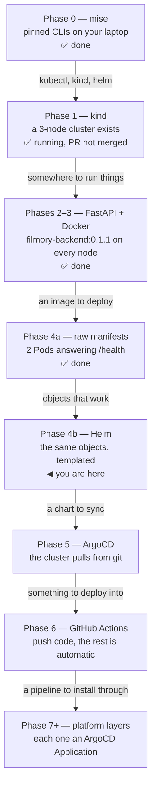
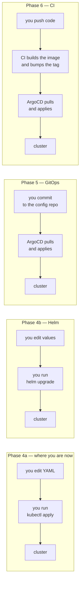
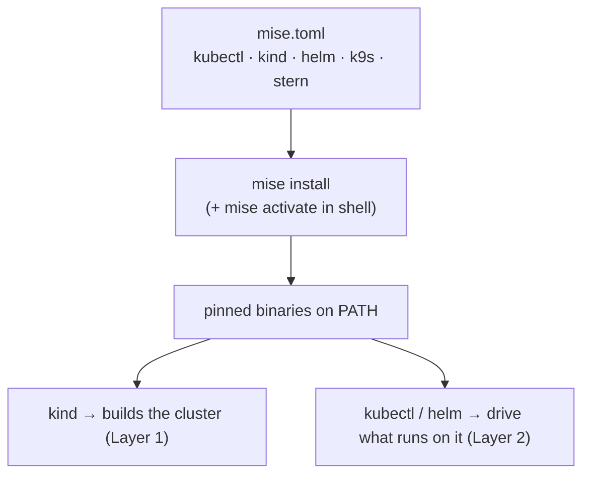
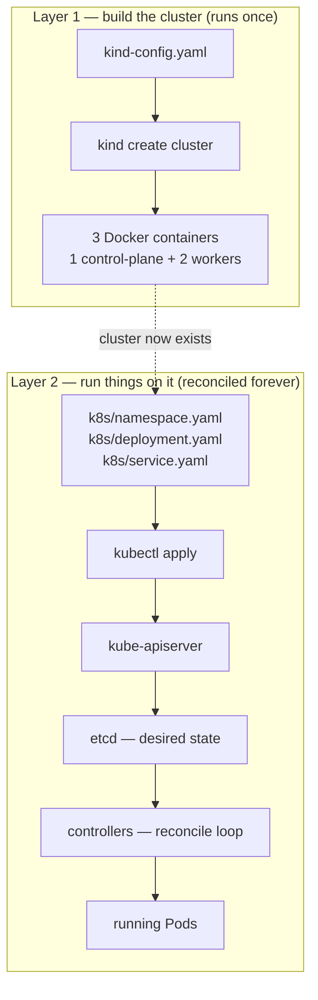
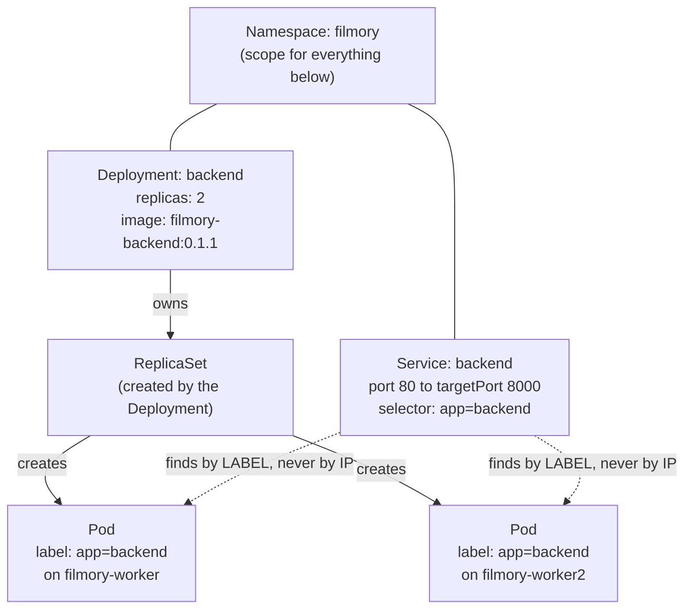
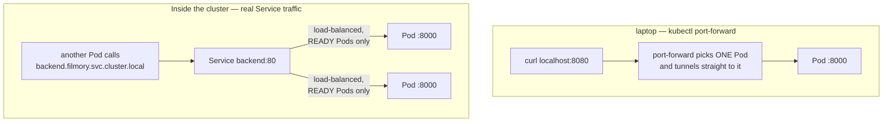
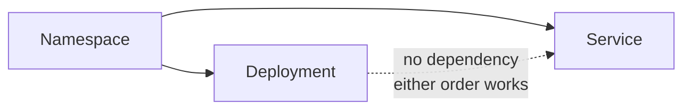
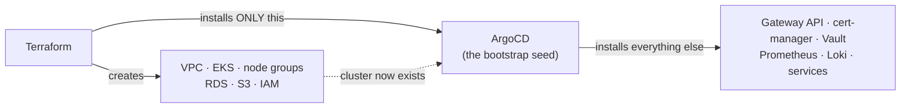

# Infrastructure

## index

- [to do](#to-do)
  - [The shape of the whole thing](#the-shape-of-the-whole-thing)
  - [What each phase actually removes](#what-each-phase-actually-removes)
  - [Phase 0 — Local tooling](#phase-0--local-tooling)
  - [Phase 1 — Cluster · infra/kind-setup](#phase-1--cluster--infrakind-setup)
  - [Phase 2 — The payload · feat/backend-health](#phase-2--the-payload--featbackend-health)
  - [Phase 3 — Containerize · infra/dockerfiles](#phase-3--containerize--infradockerfiles)
  - [Phase 4a — Deploy with raw manifests](#phase-4a--deploy-with-raw-manifests)
  - [Phase 4b — Deploy with Helm · infra/helm-charts](#phase-4b--deploy-with-helm--infrahelm-charts)
  - [Phase 5 — GitOps bootstrap · infra/argocd-bootstrap](#phase-5--gitops-bootstrap--infraargocd-bootstrap)
  - [Phase 6 — CI · infra/cicd-pipeline](#phase-6--ci--infracicd-pipeline)
  - [Phase 7+ — Platform layers, all via GitOps](#phase-7--platform-layers-all-via-gitops)
- [Notes on the stack](#notes-on-the-stack)
- [Workflow](#workflow)
  - [Layer 0 — mise.toml, and why it belongs to neither](#layer-0--misetoml-and-why-it-belongs-to-neither)
  - [Two layers, and why kind-config.yaml comes first](#two-layers-and-why-kind-configyaml-comes-first)
  - [Why Namespace, Deployment, and Service are separate objects](#why-namespace-deployment-and-service-are-separate-objects)
  - [The request path](#the-request-path)
  - [Ordering](#ordering)
  - [Where Terraform fits — and why not yet](#where-terraform-fits--and-why-not-yet)
- [Learning resources](#learning-resources)
  - [Fundamentals — read these first](#fundamentals--read-these-first)
  - [Phases 1–3 — cluster, container, app (done)](#phases-13--cluster-container-app-done)
  - [Phase 4b — Helm (next)](#phase-4b--helm-next)
  - [Phase 5 — GitOps](#phase-5--gitops)
  - [Phase 6 — CI](#phase-6--ci)
  - [Phase 7+ — platform layers](#phase-7--platform-layers)
  - [If you want to go deeper later](#if-you-want-to-go-deeper-later)

---

## to do

Ordered as a **walking skeleton**: get one thin slice running end-to-end before
making any single layer good. Working down the tech table in the README instead
means three weeks on Vault and Istio with nothing a human can look at.

Rule for branches: *a branch holds commits you intend to merge.* Machine setup
changes no files, so it gets no branch.

### The shape of the whole thing

Each phase produces one artifact the next phase consumes. Nothing here is
optional-but-nice: skip a box and the one after it has nothing to stand on.

**Why this order and not the tech table in the README:** the README lists the
stack; this lists a *walking skeleton*. Every phase up to 5 is one thin slice
running end to end. Working down the README instead means three weeks on Vault
and Istio with nothing a human can look at.

### What each phase actually removes

The clearer way to read the plan: every phase deletes a manual step. Watch where
the human sits.

At 4a and 4b you are the deployment mechanism — the cluster changes because you
typed a command at it. From Phase 5 the arrow reverses: **the cluster pulls**,
and your only action is a commit. By Phase 6 you are back to writing Python and
the infrastructure moves on its own.

That reversal is the single most important idea in the plan. Helm does not
deliver it — 4b still has you running `helm upgrade` by hand. Helm exists to
give ArgoCD something worth syncing.

### Phase 0 — Local tooling

Tool versions live in `mise.toml`, pinned and identical on macOS and Linux —
see the README for the four-step setup. Deliberately not Ansible: that earns
its place across many machines or ones that get rebuilt, and the README scopes
it to the cloud phase. `mise.toml` rides along in the Phase 1 branch rather than
getting one of its own.

- [x] Docker Desktop — already installed
- [x] `brew install mise`
- [x] Activate mise in the shell (`eval "$(mise activate zsh)"` in `~/.zshrc`)
- [x] `mise install` — kubectl 1.36.4, kind 0.32.0, helm 4.2.4, k9s 0.51.0, stern 1.34.0
- [x] Versions pinned in `mise.toml` and committed
- [x] Confirmed in a fresh shell: `kubectl` and `kind` resolve to mise installs

### Phase 1 — Cluster · `infra/kind-setup`

First real branch — `kind-config.yaml` is the first file that gets committed.
Verify the cluster is up *before* opening the PR.

- [ ] Write `kind-config.yaml` (1 control-plane + 2 workers)
- [ ] `kind create cluster --config kind-config.yaml`
- [ ] Verify: `kubectl cluster-info` / `kubectl get nodes` → 3 nodes Ready
- [ ] **Check version skew**: note the k8s version kind reports and compare to
      `kubectl version`. kubectl is pinned at 1.36.4; if the cluster is more
      than one minor behind, pin kind's node image to match or drop kubectl's
      pin in `mise.toml`. This is exactly what pinning exists to make visible.
- [ ] PR → merge

### Phase 2 — The payload · `feat/backend-health`

**✅ Done.**

Twenty lines of Python. Empty infrastructure cannot be tested — Helm charts that
deploy nothing and CI that builds nothing can't be told apart from broken ones.
This service stays in the repo forever as the liveness probe target.

- [x] FastAPI app with a single `GET /health` → `{"ok": true}` (`backend/main.py`)
- [x] `requirements.txt` pinned from what actually resolved (fastapi 0.141.1,
      uvicorn 0.52.4)

### Phase 3 — Containerize · `infra/dockerfiles`

**✅ Done.**

- [x] Multi-stage Dockerfile, non-root user
- [x] `.dockerignore`
- [x] `docker build` → `filmory-backend:0.1.1`
- [x] `kind load docker-image` → present on all three nodes

**Learned the hard way:** `USER app` (a name) fails under `runAsNonRoot: true` —
the kubelet can't verify a non-numeric user is non-root and refuses to start the
container. Use `USER 10001`.

### Phase 4a — Deploy with raw manifests

**✅ Done.**

Raw YAML before Helm, deliberately: Helm is a templating engine over exactly
these objects, and learning both at once means understanding neither.

- [x] `k8s/namespace.yaml`, `k8s/deployment.yaml`, `k8s/service.yaml`
- [x] Liveness + readiness probes on `/health`
- [x] securityContext: non-root, no privilege escalation, read-only rootfs,
      all capabilities dropped
- [x] resources requests + limits
- [x] `kubectl apply -f k8s/` → 2 Pods Running, one per worker
- [x] Verified: `kubectl port-forward` → `{"ok":true}`, HTTP 200

**Learned the hard way:** `kubectl apply -f <dir>` processes files
alphabetically, so `deployment.yaml` is attempted before `namespace.yaml`.
Re-running fixes it; ArgoCD solves it properly with sync waves.

### Phase 4b — Deploy with Helm · `infra/helm-charts`

Same objects, now templated so dev/staging/prod differ by values rather than by
copied YAML.

- [ ] `helm create` and strip the scaffolding down to what we actually use
- [ ] Move image tag, replica count, and resources into `values.yaml`
- [ ] `helm install` → same two Pods, same `/health` response
- [ ] Verify: `helm uninstall` removes everything cleanly

### Phase 5 — GitOps bootstrap · `infra/argocd-bootstrap`

Moved ahead of CI deliberately. Modern practice installs ArgoCD early and lets
it install everything else — you stop running `helm install` by hand and start
committing `Application` manifests. Phase 4 was the one manual pass, so you know
what is being automated.

Needs the **config repo** from the README: Helm charts + Kustomize overlays
(`overlays/dev`, `overlays/staging`, `overlays/prod`). ArgoCD watches that repo.

- [ ] Create the config repo, move the Phase 4 chart into it
- [ ] Install ArgoCD, bootstrap with the **app-of-apps** pattern
- [ ] Re-adopt the backend chart as an ArgoCD `Application`
- [ ] Verify: `helm uninstall` the manual release → ArgoCD puts it back
- [ ] Verify: commit to config repo → cluster converges with no kubectl

### Phase 6 — CI · `infra/cicd-pipeline`

- [ ] GitHub Actions: lint + test on PR
- [ ] Build image, tag with commit SHA (never `latest`)
- [ ] Push to the registry (GHCR to start; Harbor at Phase 7)
- [ ] Bump the config repo tag so ArgoCD picks it up
- [ ] Require the CI check in branch protection now that it exists
- [ ] Raise required approving reviews back to 1

Stretch, only if time allows: sign images with cosign, generate an SBOM with
syft, and enforce signatures at admission with Kyverno.

### Phase 7+ — Platform layers, all via GitOps

Every item is an ArgoCD `Application`, not a manual install. Add each when its
absence hurts, not in list order. Stack follows the README.

- [ ] **Calico / Cilium** — CNI and NetworkPolicy. Installing either means
      recreating the cluster with `disableDefaultCNI: true`; see the note in
      `kind-config.yaml`.
- [ ] **MetalLB** — real LoadBalancer IPs
- [ ] **Gateway API** + **cert-manager** — external routing and TLS
- [ ] **Longhorn** — PVCs that survive node loss (local-path is fine before this)
- [ ] MySQL, Redis, MinIO, NATS — the real backing services
- [ ] **Vault + Vault Secrets Operator** — DB creds, JWT/2FA keys, scraper keys
- [ ] **Harbor** — private registry, fed by CI
- [ ] **Prometheus + Grafana + Alertmanager** — metrics and alerts
- [ ] **Loki + Promtail** — searchable logs
- [ ] **KEDA** — event-driven scaling for the news consumer
- [ ] **Istio** — mTLS, traffic shaping
- [ ] **Terraform**, optionally **Ansible** — cloud phase only; the trigger
      conditions and the Terraform/ArgoCD boundary are in
      [Where Terraform fits](#where-terraform-fits--and-why-not-yet)

## Notes on the stack

Sticking to the README's picks deliberately. They are the mainstream tools —
far more tutorials, answers, and employer recognition than the newer
alternatives, which matters more for learning than being current does.

Two things to be aware of rather than act on:

- **Promtail is deprecated.** Grafana replaced it with Alloy and Promtail has
  reached end of life. It still works and is heavily documented, so it is fine
  to learn on — just expect no further fixes, and know Alloy is the successor.
- **Terraform and Vault are BUSL-licensed** (OpenTofu and OpenBao are the open
  forks). Irrelevant for a personal project; worth knowing the history exists.

Versions and project statuses move fast — confirm current releases before
pinning anything.

## Workflow

### Layer 0 — `mise.toml`, and why it belongs to neither

The two layers below are both *cluster*. `mise.toml` is neither: it provisions
**laptop**. Nothing in Kubernetes ever reads it, and deleting it would not
disturb a running cluster by one Pod — it only means the next person to clone
the repo gets whatever `kubectl` their package manager felt like handing them.

`mise activate` is the half that is easy to skip and silently breaks everything:
without it the shims never reach `PATH`, `kubectl` resolves to some older
system binary, and you debug a version-skew problem that is really a `~/.zshrc`
problem. `mise ls --current` is the one-line answer to *"which kubectl am I
actually running?"*

**The pins are coupled, not independent.** `kubectl` is supported within one
minor version of the apiserver, and the apiserver version comes from the node
image `kind` ships with — so bumping `kind` can move the cluster out from under
a pinned `kubectl`. That is the whole point of the Phase 1 skew check: pinning
does not prevent skew, it makes skew *visible* at a moment you can act on it.

| Command | When you reach for it |
|---|---|
| `mise install` | after cloning, and after anyone bumps a pin |
| `mise ls --current` | verifying what is actually on `PATH` |
| `mise use kind@0.33.0` | changing a pin — rewrites `mise.toml`, then commit it |
| `mise exec -- kubectl ...` | one-off in a shell with no activation (CI) |

What deliberately stays out:

- **Docker** — a daemon, not a CLI binary, and installed differently per OS.
- **Python packages** — `requirements.txt`, pinned inside the image.
- **Anything the cluster runs** — image tags belong in manifests and Helm
  values. A version in `mise.toml` describes a tool you type; a version in
  `values.yaml` describes something that runs without you.

The one addition worth making later: when backend work moves to local dev,
`python = "3.13"` belongs here, pinning the interpreter you *develop* against
next to the Dockerfile pinning the one that *ships*. Two pins on purpose — and
they should agree.

At Phase 6, CI reads the same file (`jdx/mise-action`), which is what makes
"works on my machine" and "works in the pipeline" the same claim rather than two
hopeful ones. Why this and not Ansible is settled in [Phase 0](#phase-0--local-tooling).

### Two layers, and why `kind-config.yaml` comes first

`kind-config.yaml` builds the **cluster**. `k8s/*.yaml` describes what **runs on**
it. You cannot apply a Deployment to a cluster that does not exist yet.

The sharpest difference: Kubernetes never reads `kind-config.yaml`. The `kind`
CLI reads it once, creates containers, and is done. The manifests in `k8s/` go
the other way — they are stored *inside* the cluster and acted on forever.

This is why deleting a Pod brings it back. The Deployment object still sits in
etcd saying `replicas: 2`, and the controller keeps reconciling toward it.

### Why Namespace, Deployment, and Service are separate objects

Because they change at completely different rates. Fusing them would mean
rewriting the network config on every image bump, and the Service IP would move
on every release.

| Object | Changes | Job |
|---|---|---|
| Namespace | almost never | a scope for names, quotas, policy |
| Service | almost never | stable IP + DNS name in front of churning Pods |
| Deployment | every deploy | which image, how many replicas |

Nothing is wired by name or address — everything is matched by **label**. That is
precisely why Pods can be destroyed and replaced freely: a new Pod gets a new IP,
carries the same label, and the Service picks it up with no config change.

### The request path

Two different paths, and they are easy to confuse.

`kubectl port-forward svc/backend` does **not** load-balance. It resolves the
Service to a single Pod and tunnels directly to it, bypassing kube-proxy
entirely — which is why a port-forward dies when that particular Pod is deleted.
It is a debugging tool, not a preview of production traffic.

Readiness probes gate the real path: a Pod failing `/health` is removed from the
Service and receives no traffic, without being restarted. A failing *liveness*
probe is the one that triggers a restart.

### Ordering

Only one hard dependency exists:

A Service can exist with zero Pods behind it; a Deployment can run with nothing
in front of it. Only the Namespace must come first.

This is why `kubectl apply -f k8s/` failed the first time — it reads files
**alphabetically**, so `deployment.yaml` ran before `namespace.yaml`. Re-running
fixed it. ArgoCD solves it properly in Phase 5 with sync waves.

Note that splitting into three *files* is only convention. Objects must be
separate; files need not be — one file with `---` separators is equally valid.

### Where Terraform fits — and why not yet

Terraform is a third layer, underneath both of the ones above: it creates the
machines, network, and managed services that a cluster needs *before* a cluster
can exist. Locally that layer is already handled — `kind-config.yaml` plus
Docker does it in eleven lines, for free, in about thirty seconds.

So the honest answer to "when do we add Terraform" is: **when there is something
to provision that has no kube-apiserver to talk to.** Today there is nothing.

| Layer | Locally, today | In cloud |
|---|---|---|
| Machines, network, managed services | `kind-config.yaml` + Docker | Terraform — VPC, EKS, node groups, RDS, S3, IAM |
| Everything running on the cluster | `k8s/`, then Helm, then ArgoCD | unchanged — still ArgoCD |

That table is the payoff of the phase order. Moving to AWS replaces the bottom
layer and leaves the top one alone; charts and `Application` manifests written
at Phases 4b and 5 are not rewritten, they are re-pointed.

**Add it when any of these is true:**

- the project moves off kind onto a real cloud — the actual trigger here, and
  what the README means by *IaC (cloud phase only)*
- something outside Kubernetes has to be created: a DNS zone, cloud IAM roles, a
  managed database, an object-storage bucket
- more than one environment of the above exists, where doing it twice by hand
  has already drifted and nobody can say how

**Don't add it for:**

- **creating kind clusters.** A provider exists. It wraps a single CLI call and
  hands you a state file to lose in exchange.
- **installing charts or manifests once ArgoCD is in.** The `helm` and
  `kubernetes` providers put a second reconciler next to ArgoCD, both convinced
  they own the same objects. Pick one owner per resource; in-cluster, that is
  ArgoCD.
- **anything before Phase 6.** Terraform without a pipeline to run it and a
  remote state backend is a laptop with extra steps.

The boundary in practice — Terraform stops at ArgoCD:

ArgoCD is the deliberate exception to "Terraform does not install in-cluster
things": something has to place the first controller, and after that ArgoCD
places the rest. Slot it in as `infra/terraform` after Phase 6, so `plan` and
`apply` run in CI from the start rather than being retrofitted.

The pitfall to plan for is **state**, not syntax. Local state is fine for a solo
experiment and stops being fine the moment a second machine or a pipeline runs
`apply`; move to a remote backend with locking before that, not after the first
corrupted state file. Licensing is a footnote here — see the BUSL note above if
OpenTofu ever matters.

---

## Learning resources

Ordered by when you'll need them, not alphabetically. Don't read ahead — each
group makes far more sense once the previous phase is working.

### Fundamentals — read these first

| Topic | Resource |
|---|---|
| Kubernetes basics | [Learn Kubernetes Basics](https://kubernetes.io/docs/tutorials/kubernetes-basics/) — the official guided tutorial |
| Core concepts | [Kubernetes Concepts](https://kubernetes.io/docs/concepts/) — reference, dip in and out |
| Hands-on practice | [Killercoda](https://killercoda.com/) — free browser scenarios, no local cluster needed |
| Toolchain pinning | [mise docs](https://mise.jdx.dev/) — config file, activation, `mise use` |
| Config conventions | [Configuration Best Practices](https://kubernetes.io/docs/concepts/configuration/overview/) |
| App design | [The Twelve-Factor App](https://12factor.net/) — why containers expect config in env vars |
| The ecosystem map | [CNCF Landscape](https://landscape.cncf.io/) — see how much you're deliberately skipping |

### Phases 1–3 — cluster, container, app *(done)*

| Topic | Resource |
|---|---|
| kind config | [kind — Configuration](https://kind.sigs.k8s.io/docs/user/configuration/) — multi-node, port mappings |
| Multi-stage builds | [Docker — Multi-stage](https://docs.docker.com/build/building/multi-stage/) |
| FastAPI | [FastAPI docs](https://fastapi.tiangolo.com/) |

### Phase 4b — Helm *(next)*

| Topic | Resource |
|---|---|
| Templating | [Chart Template Guide](https://helm.sh/docs/chart_template_guide/) — **start here**, work through it in order |
| Chart conventions | [Chart Best Practices](https://helm.sh/docs/chart_best_practices/) |
| Kustomize | [Kustomize reference](https://kubectl.docs.kubernetes.io/references/kustomize/) — the overlay half of the plan |

### Phase 5 — GitOps

| Topic | Resource |
|---|---|
| ArgoCD setup | [Getting Started](https://argo-cd.readthedocs.io/en/stable/getting_started/) |
| App-of-apps | [Cluster Bootstrapping](https://argo-cd.readthedocs.io/en/stable/operator-manual/cluster-bootstrapping/) — the pattern Phase 5 uses |

### Phase 6 — CI

| Topic | Resource |
|---|---|
| CI | [GitHub Actions docs](https://docs.github.com/en/actions) |
| Automated bumps | [Renovate](https://docs.renovatebot.com/) |
| *Stretch* — image signing | [cosign](https://docs.sigstore.dev/cosign/signing/overview/) |
| *Stretch* — SBOMs | [syft](https://github.com/anchore/syft) |
| *Stretch* — admission policy | [Kyverno](https://kyverno.io/docs/) |

### Phase 7+ — platform layers

| Topic | Resource |
|---|---|
| CNI | [Cilium docs](https://docs.cilium.io/en/stable/) · [Calico docs](https://docs.tigera.io/calico/latest/about/) |
| Load balancer | [MetalLB](https://metallb.io/) |
| Routing | [Gateway API](https://gateway-api.sigs.k8s.io/) |
| TLS | [cert-manager](https://cert-manager.io/docs/) |
| Service mesh | [Istio — Getting Started](https://istio.io/latest/docs/setup/getting-started/) |
| Storage | [Longhorn](https://longhorn.io/docs/) |
| Registry | [Harbor](https://goharbor.io/docs/) |
| Secrets | [Vault docs](https://developer.hashicorp.com/vault/docs) |
| Event autoscaling | [KEDA](https://keda.sh/docs/latest/) |
| Metrics | [Prometheus](https://prometheus.io/docs/introduction/overview/) · [Grafana](https://grafana.com/docs/grafana/latest/) |
| Logs | [Loki](https://grafana.com/docs/loki/latest/) · [Promtail](https://grafana.com/docs/loki/latest/send-data/promtail/) |
| IaC (cloud phase) | [Terraform](https://developer.hashicorp.com/terraform/docs) · [Ansible](https://docs.ansible.com/ansible/latest/index.html) |

### If you want to go deeper later

| Topic | Resource |
|---|---|
| How k8s actually works | [Kubernetes the Hard Way](https://github.com/kelseyhightower/kubernetes-the-hard-way) — build a cluster by hand, no shortcuts. Excellent, and a weekend. Do it *after* Sep 14. |
