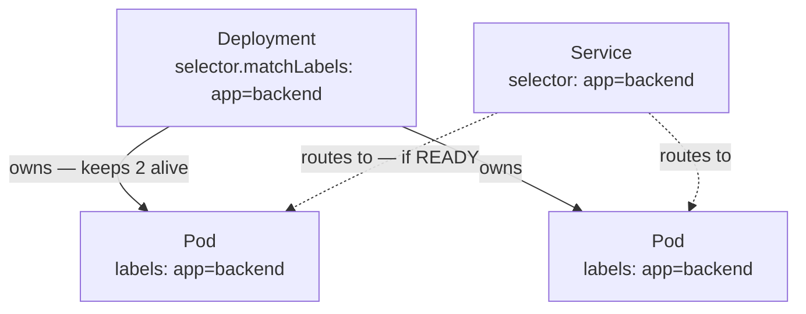
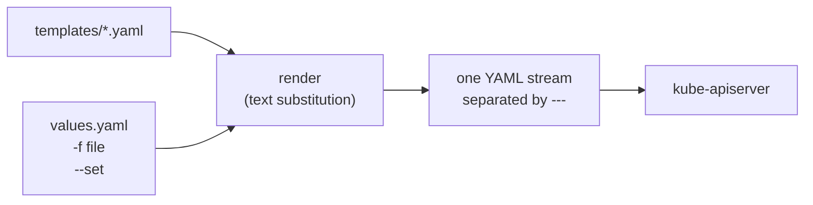

# Helm

Reference for the chart in [charts/backend](../charts/backend). Written while
building it, so it explains *why* each piece exists rather than restating the
official docs. Phase 4b of [INFRA.md](../INFRA.md).

Kubernetes concepts this assumes are in [K8s_KIND.md](K8s_KIND.md).

## index

- [Orientation](#orientation)
- [Labels, selectors, and namespaces](#labels-selectors-and-namespaces)
- [What a chart actually is](#what-a-chart-actually-is)
- [Chart.yaml](#chartyaml)
- [templates/ — the only part Kubernetes sees](#templates--the-only-part-kubernetes-sees)
- [The one thing to understand about templating](#the-one-thing-to-understand-about-templating)
- [Template syntax](#template-syntax)
  - [Built-in objects](#built-in-objects)
  - [Whitespace control](#whitespace-control)
  - [Pipelines and the functions worth knowing](#pipelines-and-the-functions-worth-knowing)
- [values.yaml and the merge order](#valuesyaml-and-the-merge-order)
- [Chart vs release vs revision](#chart-vs-release-vs-revision)
- [Commands](#commands)
- [Errors, and what they actually mean](#errors-and-what-they-actually-mean)
- [Rules for this repo](#rules-for-this-repo)
- [Resources](#resources)

---

## Orientation

Where Helm sits: it does not add Kubernetes objects, it *generates* the ones you
already know. Everything below is templating over Deployment, Service, and
Namespace.


---

## Labels, selectors, and namespaces

Three things that look related and are not. The short version:

- a **namespace** is a *scope* — where an object lives
- a **label** is a *tag* — put on an object
- a **selector** is a *query* — run against labels

Only the third one searches for anything.

| Field | Appears on | Query? | Means |
|---|---|---|---|
| `metadata.namespace` | any object | no | which scope this object lives in |
| `metadata.labels` | any object | no | tags attached **to** this object |
| `spec.selector` | Service | **yes** | which Pods receive traffic |
| `spec.selector.matchLabels` | Deployment, ReplicaSet, StatefulSet, DaemonSet, Job | **yes** | which Pods this controller **owns** |
| `spec.template.metadata.labels` | Deployment | no | labels stamped onto the Pods it creates |

### Why a Service says `selector` and a Deployment says `selector.matchLabels`

Not a style inconsistency — an age difference. Service is one of the oldest
objects in Kubernetes and its selector is a plain map, equality only:

```yaml
# Service — flat. "app equals backend", and nothing more expressive is possible.
selector:
  app: backend
```

Deployment came later and uses the standard `LabelSelector` type, which has two
possible children:

```yaml
# Deployment — nested, because there is a second option
selector:
  matchLabels:            # equality, same as Service
    app: backend
  matchExpressions:       # and the part Service cannot do
    - {key: tier, operator: In, values: [web, api]}
```

`matchLabels` is the *simple half* of a richer type. That is the whole reason
for the extra level of nesting.

### The pairing that must agree

Inside one Deployment, the selector and the Pod template labels are two
different fields that must describe the same thing:

```yaml
spec:
  selector:
    matchLabels:
      app: backend        # "the Pods I own carry this"
  template:
    metadata:
      labels:
        app: backend      # "the Pods I create carry this"
```

If they disagree, the Deployment creates Pods it does not recognise as its own,
then creates more, forever. The API server rejects the mismatch rather than
allowing it. This field is also **immutable** — changing it means deleting and
recreating the Deployment.

### Namespaces do not select — they contain

The distinction that catches people: **a selector never crosses a namespace.**

```yaml
metadata:
  namespace: filmory      # not a query. A statement of address.
spec:
  selector:
    app: backend          # searched ONLY within filmory
```

A Service in `filmory` cannot select Pods in `default`, no matter what labels
they carry. Scope first, query second. That is also why the same chart can be
installed twice into two namespaces without the two releases interfering — the
labels are identical, but the searches never overlap.

### Same label, two independent readers

Nothing links a Deployment to a Service. They are two separate queries that
happen to match the same label:



Delete the Service and the Pods keep running. Delete the Deployment and the
Service resolves to an empty list and returns connection errors. Neither knows
the other exists.

---

## What a chart actually is

A **directory** containing a `Chart.yaml`. That is the whole definition. Not a
file, not a repo, not a registry entry.

```
charts/backend/
├── Chart.yaml       # metadata. REQUIRED — this file is what makes it a chart.
├── values.yaml      # default configuration. Optional.
└── templates/       # the objects. Optional.
    ├── namespace.yaml
    ├── service.yaml
    └── deployment.yaml
```

Only `Chart.yaml` is mandatory. A chart with nothing else lints clean and
deploys nothing — worth trying once, because it makes the split obvious:
`Chart.yaml` is *metadata* and has no power to create anything.

## Chart.yaml

```yaml
apiVersion: v2          # Helm 3+. v1 is the Helm 2 era — ignore old blog posts.
name: backend           # must match the directory name
description: ...
type: application       # deployable. "library" = shared helpers, deploys nothing.

version: 0.1.0          # the CHART's version
appVersion: "0.1.1"     # the version of the app inside the image
```

**The two version fields are the thing people get wrong.** They move
independently:

| Change | `version` | `appVersion` |
|---|---|---|
| Fix a typo in a template | bump | unchanged |
| Add a value | bump | unchanged |
| Ship new FastAPI code | bump | bump |

`version` must be bumped on **every** chart change, even whitespace. ArgoCD and
OCI registries key off it — forgetting is the classic *"it says synced but
nothing changed"*.

`appVersion` is quoted because `0.1.1` is not a valid number. Unquoted, `1.10`
silently becomes `1.1`.

## templates/ — the only part Kubernetes sees

Every file in `templates/` is rendered and concatenated into one stream of YAML
documents. That stream is what gets sent to the API server.



Helm adds two things you did not write: `---` separators between documents, and
a `# Source: <file>` comment above each. The comment is a breadcrumb — with
twenty templates, it tells you which file produced the object that broke.

A file in `templates/` containing **no template syntax at all** is completely
legal. Templating is a capability, not a requirement, and most real charts have
files that are never parameterized.

Files whose names start with `_` (like `_helpers.tpl`) are the exception: they
are rendered but never emitted as objects. That is where shared snippets live.

## The one thing to understand about templating

> **Helm does not understand YAML.** It is a *text* templating engine. It does
> string substitution on the file, then hands the resulting text to Kubernetes
> to parse.

Almost every confusing Helm error follows from this. An indentation bug is not
Helm being fussy — Helm produced text that is not valid YAML, and the parser
downstream complained. Even the comments in your source file survive into the
output, because Helm never parsed them as anything but characters.

**The habit that follows:** when stuck, run `helm template` and read the text.
Do not guess at the template. Look at what it produced.

## Template syntax

Everything between `{{ }}` is evaluated and replaced.

```yaml
image: {{ .Values.image.repository }}:{{ .Values.image.tag }}
```

The leading `.` is the current scope, which at the top of a file is the root
context.

### Built-in objects

| Object | Holds | Example |
|---|---|---|
| `.Values` | merged values (see below) | `.Values.replicaCount` |
| `.Chart` | fields from `Chart.yaml` | `.Chart.Name`, `.Chart.AppVersion` |
| `.Release` | facts about *this* install | `.Release.Name`, `.Release.Namespace` |
| `.Capabilities` | what the cluster supports | `.Capabilities.KubeVersion` |
| `.Files` | non-template files in the chart | `.Files.Get "config.json"` |

Note the capitalisation: built-ins are capitalised, your own values are however
you wrote them in `values.yaml`.

`.Release.Namespace` is why hardcoding `namespace:` in a template is a mistake —
the release already knows its namespace, and hardcoding pins the chart to one
environment forever.

### Whitespace control

The hyphen trims whitespace on that side of the tag.

| Written | Effect |
|---|---|
| `{{ ... }}` | leaves surrounding whitespace and the newline |
| `{{- ... }}` | trims whitespace *before* |
| `{{ ... -}}` | trims whitespace *after* |

Control blocks (`if`, `range`, `define`) emit the line they sit on unless
trimmed, which is why they are nearly always written `{{- if ... }}`. Forgetting
leaves blank lines that break YAML indentation.

### Pipelines and the functions worth knowing

`|` passes the left value into the function on the right, like a shell pipe.

| Function | Does | Example |
|---|---|---|
| `quote` | wraps in double quotes | `tag: {{ .Values.image.tag \| quote }}` |
| `default` | fallback when empty | `{{ .Values.tag \| default .Chart.AppVersion }}` |
| `nindent N` | newline + indent every line by N | `{{- toYaml .Values.resources \| nindent 12 }}` |
| `toYaml` | render a values subtree as YAML | as above |
| `required` | fail the render with a message | `{{ required "tag is required" .Values.tag }}` |

`toYaml | nindent` is the pattern for injecting a whole block (resources,
nodeSelector, annotations) without hand-writing every field. `nindent` rather
than `indent` because the block needs to start on its own line.

`required` is how you make a mistake fail at render time instead of producing a
broken object in the cluster.

## values.yaml and the merge order

Later wins:

```
chart's values.yaml   <   -f custom.yaml   <   --set key=value
```

`values.yaml` holds **defaults**, not configuration. `-f environments/prod.yaml`
lists only what differs — a production overrides file is usually 10–20 lines,
never a copy of the chart's values.

A chart's own `values.yaml` always loads automatically. Passing
`--values charts/backend/values.yaml` is redundant; `-f` is for *additional*
files layered on top.

**A value earns its place** by differing between environments, or by being
rewritten in CI. Nothing else. Probes, securityContext, and ports are neither —
they stay hardcoded. Promoting a value later is easy; demoting one is not.

Environments are values files, never separate charts:

```
charts/backend/        # the objects, written once
environments/dev.yaml  # only the differences
environments/prod.yaml
```

The test: **does it produce Kubernetes objects?** Yes → chart. No, it only
changes them → values file.

## Chart vs release vs revision

| Term | What it is |
|---|---|
| chart | files on disk |
| release | one named install of a chart into a namespace |
| revision | one version of a release — every `upgrade` makes a new one |

The same chart can be installed many times as different releases
(`backend-dev`, `backend-staging`). Helm stores release state in a Secret in the
release namespace — not in a database, and not on your laptop. That is why
`helm list` works from any machine with cluster access.

Ownership is tracked by three pieces of metadata Helm stamps on every object:

```
label      app.kubernetes.io/managed-by   = Helm
annotation meta.helm.sh/release-name      = <release>
annotation meta.helm.sh/release-namespace = <namespace>
```

That is the entire mechanism. Objects created by `kubectl apply` do not carry
them, which is why Helm refuses to adopt them without `--take-ownership`.

## Commands

| Command | Touches cluster | Use |
|---|---|---|
| `helm lint <chart>` | no | is the chart well-formed? |
| `helm template <rel> <chart>` | no | **render and read the text** — live in this one |
| `helm install <rel> <chart> -n <ns>` | yes | create a release |
| `helm upgrade <rel> <chart> -n <ns>` | yes | new revision of an existing release |
| `helm list -n <ns>` | yes | what releases exist |
| `helm history <rel> -n <ns>` | yes | revisions of a release |
| `helm rollback <rel> <n> -n <ns>` | yes | back to revision n |
| `helm uninstall <rel> -n <ns>` | yes | delete the release and its objects |

Useful flags:

- `--dry-run --debug` — render *and* validate against the real API server.
  Stronger than `helm template`, which never contacts the cluster.
- `--take-ownership` — adopt existing unlabelled objects into the release.
- `--create-namespace` — create the namespace if absent, so it need not be a
  template.
- `--atomic` — roll back automatically if the upgrade fails. Worth defaulting to.

`helm lint` only checks *chart* structure. It says nothing about whether your
Deployment is valid Kubernetes. For that, `helm template | kubeconform -strict`.

## Errors, and what they actually mean

| Message | Cause |
|---|---|
| `invalid ownership metadata` | object exists without Helm's three keys — `--take-ownership` or delete it |
| `cannot re-use a name that is still in use` | release already exists — you want `upgrade`, not `install` |
| `error converting YAML to JSON` | your render produced invalid YAML — run `helm template` and read it |
| `did not find expected key` | almost always an `indent`/`nindent` off by a level |
| `nil pointer evaluating interface {}` | a value referenced in a template is missing from values |
| `release: not found` | wrong `-n` namespace |

## Rules for this repo

1. Start from working manifests, not `helm create`. The scaffold ships an
   Ingress, HPA, ServiceAccount, and a `_helpers.tpl` you did not write.
2. First commit of a chart renders **byte-identical** to the manifests it
   replaces. Any later difference is deliberate.
3. Parameterize one value at a time, verifying the render after each.
4. `version` bumps on every chart change.
5. One chart per service, under `charts/<service>/`.
6. Environments are values files, never charts.
7. Secrets never go in values. That is Phase 7 — External Secrets Operator.

## Resources

| Topic | Link |
|---|---|
| Templating, in order | [Chart Template Guide](https://helm.sh/docs/chart_template_guide/) |
| Functions and pipelines | [Template Functions and Pipelines](https://helm.sh/docs/chart_template_guide/functions_and_pipelines) |
| Every Chart.yaml field | [Charts](https://helm.sh/docs/topics/charts) |
| Conventions | [Chart Best Practices](https://helm.sh/docs/chart_best_practices/) |
| Full function list | [Function list](https://helm.sh/docs/chart_template_guide/function_list/) |
| Worked example | [kubernetes-helm-demo](https://gitlab.com/groups/kubernetes-helm-demo) |
| Curated list | [resource.md](resource.md) |
