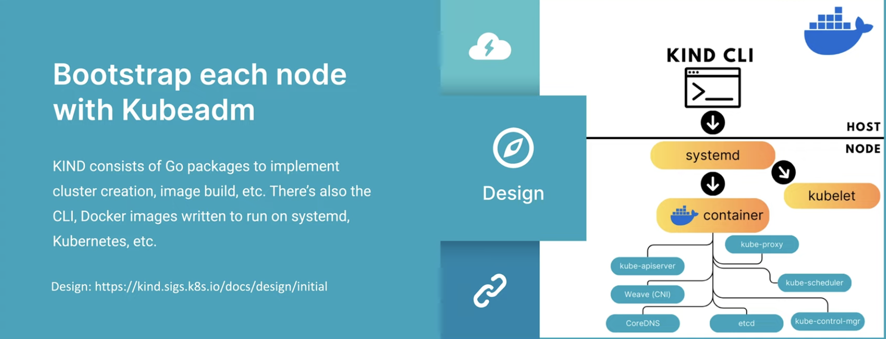
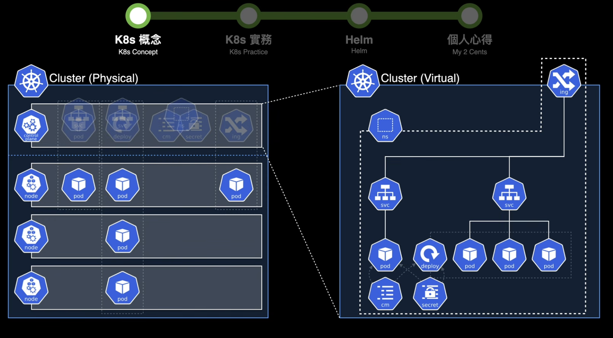
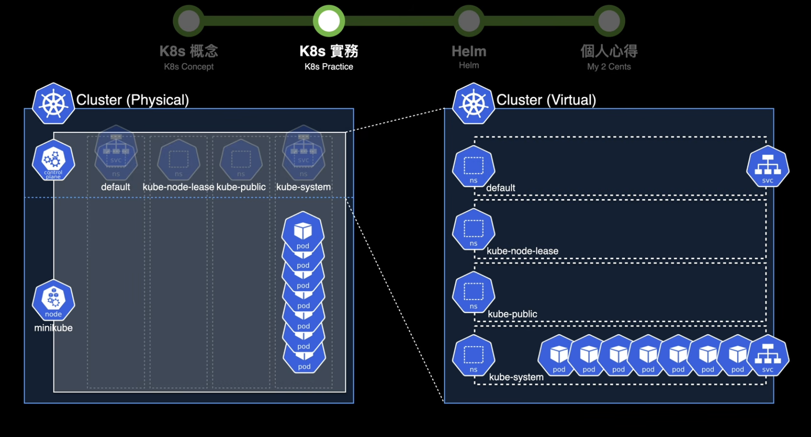
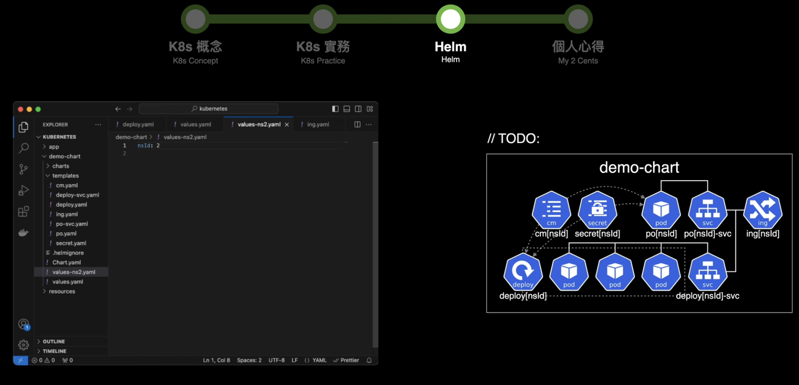
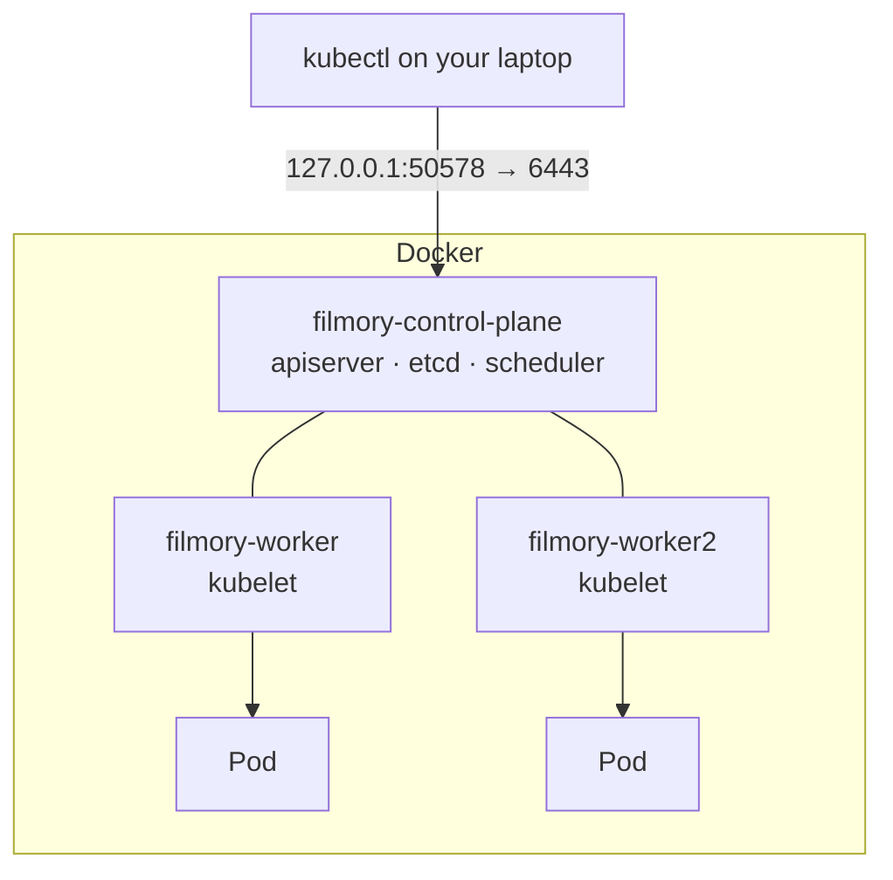

# kind

Reference for [kind-config.yaml](kind-config.yaml) and the local cluster it
builds. Phase 1 of [INFRA.md](INFRA.md). Written against the cluster actually
running here — kind v0.32.0, node image v1.36.1, three nodes.

## index

- [What kind is](#what-kind-is)
- [The nodes are Docker containers](#the-nodes-are-docker-containers)
- [kind-config.yaml](#kind-configyaml)
  - [Fields we use](#fields-we-use)
  - [Fields we will need later](#fields-we-will-need-later)
- [Cluster lifecycle](#cluster-lifecycle)
- [Getting images in — there is no registry](#getting-images-in--there-is-no-registry)
- [Versions and skew](#versions-and-skew)
- [kubeconfig and contexts](#kubeconfig-and-contexts)
- [What kind cannot do](#what-kind-cannot-do)
- [Errors, and what they actually mean](#errors-and-what-they-actually-mean)
- [The neighbours](#the-neighbours)
- [Rules for this repo](#rules-for-this-repo)

---

## kubernetes brief 
- Kubernetes (and Helm) in 21 Minutes
https://www.youtube.com/watch?v=RUjcGn2YeVo

- General Concept/Stucture 


- K8s Practice


- ingress 


- helm



## What kind is

**K**ubernetes **IN** **D**ocker. It runs a real, unmodified Kubernetes cluster
where each *node* is a Docker container instead of a machine.

It is not a Kubernetes distribution and not a lightweight variant — the cluster
it builds is vanilla upstream Kubernetes, installed with `kubeadm`, the same way
a real cluster is. That is the point: what you learn here transfers.

Compared to the other thing people reach for locally:

| | Vagrant | kind |
|---|---|---|
| Creates | virtual machines | Docker containers |
| Purpose | generic — any OS, any use | Kubernetes only |
| Hands you | bare machines to provision | a working cluster |
| Boot | minutes | ~30 seconds |
| Isolation | full VM, own kernel | shares the host kernel |

The last row is the tradeoff, and it comes back at Phase 7 — see
[What kind cannot do](#what-kind-cannot-do).

## The nodes are Docker containers

This is the fact that makes everything else make sense:

```console
$ docker ps --filter name=filmory
NAMES                   IMAGE                  PORTS
filmory-control-plane   kindest/node:v1.36.1   127.0.0.1:50578->6443/tcp
filmory-worker          kindest/node:v1.36.1
filmory-worker2         kindest/node:v1.36.1
```

Three containers. Each runs `kubelet` and a container runtime, so your Pods are
containers running *inside* containers.

Only the control plane publishes a port: `6443` is the kube-apiserver, mapped to
a random localhost port. That single mapping is how `kubectl` on your laptop
reaches the cluster — and it is why nothing else is reachable from the host
without extra configuration.



`docker stop filmory-worker` is a genuine node failure. Doing it once and
watching the Pods reschedule is worth more than reading about it.

## kind-config.yaml

Read **once**, by the `kind` CLI, at `create cluster` time. Kubernetes never
sees it, and editing it later changes nothing — the cluster must be recreated.
This is the opposite of everything in `k8s/`, which lives inside the cluster and
is reconciled forever.

### Fields we use

```yaml
kind: Cluster                     # the object type kind expects
apiVersion: kind.x-k8s.io/v1alpha4
name: filmory                     # → containers filmory-*, context kind-filmory

nodes:
  - role: control-plane
  - role: worker
  - role: worker
```

`name` matters more than it looks: it prefixes the container names *and* the
kubeconfig context (`kind-filmory`). Without it you get `kind`, and a second
project silently collides with the first.

Three nodes rather than one so scheduling, affinity, and node failure behave
like a real cluster. A single-node cluster hides all of it — including the thing
you already saw, two Pods landing on two different workers.

### Fields we will need later

```yaml
networking:
  disableDefaultCNI: true   # for Cilium — kind installs kindnet by default
  kubeProxyMode: none       # Cilium replaces kube-proxy entirely

nodes:
  - role: control-plane
    extraPortMappings:      # publish a container port to the host
      - containerPort: 30080
        hostPort: 8080
    extraMounts:            # bind-mount a host directory into the node
      - hostPath: /some/path
        containerPath: /data
```

`extraPortMappings` is how a Gateway or Ingress becomes reachable at
`localhost:8080` without `port-forward`. `extraMounts` is how storage that needs
real host paths gets them.

Both require a cluster recreate, which is the argument for thinking about them
before Phase 7 rather than during it.

## Cluster lifecycle

| Command | Does |
|---|---|
| `kind create cluster --config kind-config.yaml` | build it |
| `kind get clusters` | list clusters on this machine |
| `kind delete cluster --name filmory` | destroy it — instant, no confirmation |
| `kind export logs` | dump every node's logs to a directory |
| `docker stop filmory-worker` | simulate node failure |

Recreating is cheap and expected. Treat the cluster as disposable — everything
that matters is in git, and if it is not, that is the bug.

## Getting images in — there is no registry

The gotcha that catches everyone. `filmory-backend:0.1.1` is built by Docker on
your laptop. The kind nodes are *different* Docker environments and cannot see
it, and there is no registry to pull from.

```bash
kind load docker-image filmory-backend:0.1.1 --name filmory
```

This copies the image into every node. It must be re-run after **every** rebuild
— nothing watches for changes.

Two consequences:

- **`imagePullPolicy: IfNotPresent` is mandatory.** The default for a tag other
  than `latest` is already `IfNotPresent`, but state it explicitly. `Always`
  would try to pull from a registry that does not have the image and fail with
  `ErrImagePull`.
- **Never use `latest`.** Its default policy *is* `Always`, so it fails here for
  the same reason — and it is the wrong habit for Phase 6 regardless.

A rebuild without a reload is the classic "my change did not deploy": the Pod
restarts and cheerfully runs the old image, because a matching tag is already
present.

## Versions and skew

The cluster's Kubernetes version comes from the **node image**, not from the
`kind` binary version:

```
kind v0.32.0        ← the CLI, from mise.toml
kindest/node:v1.36.1 ← the cluster's actual Kubernetes version
kubectl v1.36.4      ← the client, pinned in mise.toml
```

`kubectl` is supported within **one minor version** of the apiserver. Here 1.36.4
against 1.36.1 is the same minor — zero skew.

Bumping `kind` can move the default node image and therefore the cluster
version, out from under a pinned `kubectl`. To pin the cluster version
explicitly instead of inheriting it:

```bash
kind create cluster --config kind-config.yaml --image kindest/node:v1.36.1
```

Check after every `kind` bump:

```bash
kubectl version   # compare Client Version with Server Version
```

## kubeconfig and contexts

`kind create cluster` writes into `~/.kube/config` and switches your current
context to it. The context is named `kind-<cluster name>` — here `kind-filmory`.

```bash
kubectl config current-context      # kind-filmory
kubectl config get-contexts         # everything you can reach
kubectl config use-context kind-filmory
```

Worth internalising now: `kubectl` always acts on the *current context*. The
same command is harmless locally and catastrophic against a real cluster. Check
before running anything destructive.

`kind delete cluster` removes its own entry, so contexts do not accumulate.

## What kind cannot do

The shared-kernel tradeoff, and the parts of Phase 7 it touches:

| Want | Situation on kind |
|---|---|
| `LoadBalancer` Services | stay `Pending` forever — no cloud LB exists. MetalLB, or `cloud-provider-kind` |
| Host-reachable ingress | needs `extraPortMappings`, decided at create time |
| Longhorn | wants iSCSI and kernel modules a container may not load |
| Cilium | eBPF needs kernel features and privileges; usually works, expect extra flags |
| Persistent data | `local-path` is the default StorageClass; data dies with the node |
| Real node failure | `docker stop` is close, but the kernel is still shared |
| Performance testing | meaningless — everything shares one machine |

None are blockers. All are reasons to expect extra steps at Phase 7 rather than
to be surprised by them.

## Errors, and what they actually mean

| Message | Cause |
|---|---|
| `ErrImagePull` / `ImagePullBackOff` | forgot `kind load`, or used `latest`/`Always` |
| Pod runs old code | rebuilt the image but did not `kind load` again |
| `Service` stuck `Pending` | it is `type: LoadBalancer` — nothing provides one |
| `connection refused` on kubectl | Docker is not running, or the cluster was deleted |
| `node(s) had untolerated taint` | you are scheduling onto the control plane; it is tainted by default |
| `context "kind-filmory" does not exist` | cluster deleted, or never created |

## The neighbours

| Tool | What it is | Why not here |
|---|---|---|
| **kind** | vanilla k8s in Docker, multi-node | — |
| **k3d** | k3s in Docker | k3s is not vanilla; different defaults |
| **minikube** | usually one node, can drive a real VM | multi-node is second-class |
| **Docker Desktop k8s** | one node, zero config | no control, hides scheduling |

kind is also what Kubernetes' own CI runs on, which is a decent signal it
behaves like the real thing.

## Rules for this repo

1. The cluster is disposable. Anything not in git does not exist.
2. `kind load` after every image build. Every time.
3. Never `latest`. Tags are explicit, here and in CI.
4. Check `kubectl version` skew after any `kind` or `kubectl` bump.
5. Config changes mean a recreate — plan `disableDefaultCNI` and
   `extraPortMappings` together, not one at a time.
6. Check the context before anything destructive.

---

## Resources

| Topic | Link |
|---|---|
| Config reference | [kind — Configuration](https://kind.sigs.k8s.io/docs/user/configuration/) |
| Loading images | [Loading an Image](https://kind.sigs.k8s.io/docs/user/quick-start/#loading-an-image-into-your-cluster) |
| Ingress on kind | [Ingress](https://kind.sigs.k8s.io/docs/user/ingress/) |
| LoadBalancer on kind | [cloud-provider-kind](https://github.com/kubernetes-sigs/cloud-provider-kind) |
| Node images | [kind releases](https://github.com/kubernetes-sigs/kind/releases) |


- Getting Started with KIND Kubernetes - INTRO TO KIND
https://www.youtube.com/watch?v=kR0YJfaGhfU&t=14s


- Kubernetes (and Helm) in 21 Minutes
https://www.youtube.com/watch?v=RUjcGn2YeVo