# Kubernetes & kind

Two things in one file, because you meet them together: the **concepts**
(what a Pod, Service, and Ingress are) and the **local cluster** those concepts
run on. Phase 1 of [INFRA.md](../INFRA.md), config in
[kind-config.yaml](../kind-config.yaml).

Written against the cluster actually running here — kind v0.32.0, node image
v1.36.1, three nodes.

## index

**Kubernetes**
- [Orientation](#orientation)

**kind**
- [What kind is](#what-kind-is)
- [Why kind, and why not Vagrant?](#why-kind-and-why-not-vagrant)
  - [Machine vs cluster](#machine-vs-cluster)
  - [Is a cluster virtual?](#is-a-cluster-virtual)
- [The nodes are Docker containers](#the-nodes-are-docker-containers)
- [kind-config.yaml](#kind-configyaml)
  - [Fields we use](#fields-we-use)
  - [Fields we will need later](#fields-we-will-need-later)
- [Cluster lifecycle](#cluster-lifecycle)
- [Getting images in — there is no registry](#getting-images-in--there-is-no-registry)
- [Versions and skew](#versions-and-skew)
- [kubeconfig and contexts](#kubeconfig-and-contexts)
- [What kind cannot do](#what-kind-cannot-do)
- [Errors, and what they actually mean](#errors-and-what-they-actually-mean)
- [The neighbours](#the-neighbours)
- [Rules for this repo](#rules-for-this-repo)
- [Resources](#resources)

---

## Orientation

Watch these before the rest of the file makes sense. Twenty minutes total, and
they cover the vocabulary every section below assumes.

| Video | Covers |
|---|---|
| [Kubernetes (and Helm) in 21 Minutes](https://www.youtube.com/watch?v=RUjcGn2YeVo) | the whole object model, end to end |
| [Intro to kind](https://www.youtube.com/watch?v=kR0YJfaGhfU) | the local cluster specifically |

**The object model** — how Deployment, ReplicaSet, Pod, and Service relate:


**In practice** — the same picture with real commands against it:


**Ingress** — how traffic gets in from outside the cluster. Note this is the
layer you are *skipping*: [INFRA.md](../INFRA.md) picks Gateway API instead,
because Ingress is legacy. Learn the shape here, use the successor there.


Helm gets its own file — see [HELM.md](HELM.md), which also covers
[labels, selectors, and namespaces](HELM.md#labels-selectors-and-namespaces).

---

## What kind is

**K**ubernetes **IN** **D**ocker. It runs a real, unmodified Kubernetes cluster
where each *node* is a Docker container instead of a machine.

It is not a Kubernetes distribution and not a lightweight variant — the cluster
it builds is vanilla upstream Kubernetes, installed with `kubeadm`, the same way
a real cluster is. That is the point: what you learn here transfers.

## Why kind, and why not Vagrant?

### Why kind

Five reasons, roughly in order of how much they matter here:

1. **Multi-node in thirty seconds.** This is the big one. A single-node cluster
   hides scheduling, affinity, `topologySpreadConstraints`, and node failure —
   every Pod lands in the only place it can. Three nodes made something visible
   on day one: your two backend Pods landed on two *different* workers, and you
   could see it in `kubectl get pods -o wide`.
2. **It is vanilla upstream Kubernetes.** Installed with `kubeadm`, the same
   way a real cluster is. Not a fork, not a slimmed-down variant. What you learn
   transfers to EKS or bare metal without an asterisk.
3. **It is disposable.** `kind delete cluster` then `kind create cluster` is a
   minute. That changes how you work — you stop nursing a broken cluster and
   start recreating it, which is the same instinct the whole GitOps plan is
   built on. If recreating loses something, that something should have been in
   git.
4. **No cloud, no cost, no credentials.** You can break it at 2am on a plane.
5. **It is what Kubernetes' own CI runs on.** The project tests itself with
   kind, which is about as good a signal as you get that it behaves like the
   real thing.

### Why not Vagrant

Because they answer different questions. Vagrant provisions **machines**. kind
provisions a **cluster**.

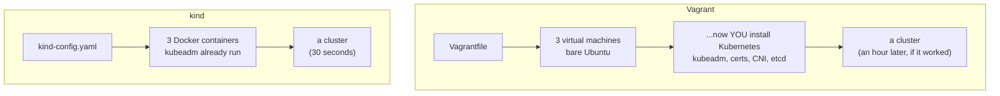

Vagrant stops at step two. Everything after it — installing Kubernetes onto
those machines — is work you would do yourself with kubeadm or Ansible. That is
a real and worthwhile exercise, but it is a *different* exercise from the one
Phase 1 is trying to teach, and doing it now would spend a week before you had
anything to deploy to.

Side by side:

| | Vagrant | kind |
|---|---|---|
| Creates | virtual machines | Docker containers |
| Purpose | generic — any OS, any use | Kubernetes only |
| Hands you | bare machines to provision | a working cluster |
| Boot | minutes | ~30 seconds |
| Kubernetes | you install it | already installed |
| Isolation | full VM, own kernel | shares the host kernel |
| Disk/RAM cost | a full OS per node | a process tree per node |

The **isolation** row is the honest tradeoff, and it is the only one where
Vagrant genuinely wins — see [What kind cannot do](#what-kind-cannot-do).

### Machine vs cluster

The row that carries all the others is *"hands you"*. It is worth being precise
about what those two words mean, because the whole difference sits there.

| | A machine | A cluster |
|---|---|---|
| Is | one computer — CPU, RAM, disk, an OS, an IP | a set of machines behind one API |
| You talk to | that machine, over SSH | the **API server**, with `kubectl` |
| You say | "run this process, here" | "I want 2 of these running" — somewhere |
| Knows about | only itself | every node, every workload, what should exist |
| If one dies | whatever was on it is gone | the work is rescheduled elsewhere |
| Is virtual? | **no** — a real thing you can point at | **yes** — nothing to point at |

A machine runs processes. It has no opinion about other machines and no memory
of what it was supposed to be doing. Three Vagrant VMs are three strangers on a
network.

A cluster is what you get when those machines share a **control plane**: a
recorded desired state (etcd), an API in front of it (kube-apiserver), and
controllers that continuously drive reality toward it. At that point the
individual machines stop mattering — they become interchangeable capacity.

### Is a cluster virtual?

Yes — but in the sense of *abstract*, not *virtualized*. Two meanings of the
word get tangled here and it is worth separating them:

| Sense | Means | Is a cluster this? |
|---|---|---|
| **virtualized** | emulated hardware — a VM, a hypervisor | **no** |
| **abstract** | a concept that exists only because software agrees it does | **yes** |

There is no cluster process, no cluster machine, no cluster you can SSH into.
What physically exists on your laptop is three Docker containers and the
processes inside them. The "cluster" is the *agreement* between them: a shared
datastore, one API in front of it, and controllers acting on what it says.

Like a team. The people are real; the team is real too, but you cannot point at
it — you point at people and at the coordination between them.

**This applies to the objects inside it as well**, and the split surprises
people:

| Object | Actually a running thing? |
|---|---|
| Node | **yes** — a container here, a machine in production |
| Pod | **yes** — real processes, real network namespace |
| Deployment / ReplicaSet | no — rows in etcd. Nothing "runs" a Deployment |
| Namespace | no — a name scope and nothing else |
| Service | no — and this is the sharp one |

The Service is the best demonstration. Yours:

```console
$ kubectl get svc,pods -n filmory -o wide
service/backend   ClusterIP   10.96.186.82   80/TCP    app=backend

pod/backend-...-79kbm   10.244.1.4   filmory-worker
pod/backend-...-t2tkf   10.244.2.3   filmory-worker2
```

**No machine has the address 10.96.186.82. No process is listening on it.** It
appears on no network interface anywhere in the cluster. It is a rule — written
by kube-proxy into every node's packet filter — that rewrites traffic bound for
that address to one of the two Pod IPs, which *are* real.

The Pod IPs are backed by processes. The Service IP is backed by nothing but
agreement. That is what "virtual" means here, and it is why deleting a Pod
changes nothing about the Service: the rule is rewritten, the address never
moves.

### The gap between them

Turning machines into a cluster is not a small step. It is roughly:

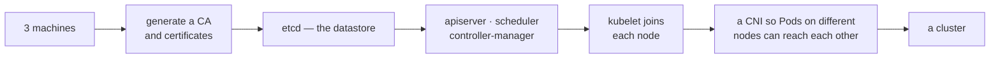

That is what `kubeadm` automates and what **kind runs for you** inside those
three containers. Vagrant hands you the box on the left and stops.

### Why this is the whole point

The shift is in what you are allowed to stop caring about.

```
machine thinking:  "which box should the backend run on?
                    what if that box reboots?"

cluster thinking:  replicas: 2
```

Your [k8s/deployment.yaml](../k8s/deployment.yaml) never names a node. It says
`replicas: 2` and lets the scheduler decide — which is why two Pods landed on
two different workers without you choosing, and why deleting one brings it back.
That behaviour is not Docker, and it is not the machines. It is the control
plane, and it is the entire reason Kubernetes exists.

### When Vagrant would actually be right

Not "never". It is the better tool when:

- **You need a real kernel per node.** Kernel modules, iSCSI for Longhorn, eBPF
  experiments, anything loading drivers. kind nodes share your laptop's kernel
  and cannot pretend otherwise.
- **The provisioning *is* the point.** Testing Ansible playbooks, OS hardening,
  or `kubeadm` itself. kind skips exactly the part you would be studying.
- **You need different operating systems**, or nodes that are not Linux.
- **You want genuine node isolation** for failure testing — `docker stop` is a
  good approximation, not a real machine dying.

Note that the first and third bullets are why
[Kubernetes the Hard Way](https://github.com/kelseyhightower/kubernetes-the-hard-way)
— the stretch goal in [INFRA.md](../INFRA.md) — is a VM exercise, not a kind
exercise. Different tool for a different lesson, later.

### One caveat on Vagrant itself

It is largely a previous era: usage has been declining for years as containers
took over local development, and like Terraform it is BUSL-licensed rather than
open source. If you ever do want VM-based Kubernetes locally, the current
options are minikube with a VM driver, Lima/Colima, or Talos in VMs — not
Vagrant. Knowing it exists is enough.

## The nodes are Docker containers

This is the fact that makes everything else make sense:

```console
$ docker ps --filter name=filmory
NAMES                   IMAGE                  PORTS
filmory-control-plane   kindest/node:v1.36.1   127.0.0.1:50578->6443/tcp
filmory-worker          kindest/node:v1.36.1
filmory-worker2         kindest/node:v1.36.1
```

Three containers. Each runs `kubelet` and a container runtime, so your Pods are
containers running *inside* containers.

Only the control plane publishes a port: `6443` is the kube-apiserver, mapped to
a random localhost port. That single mapping is how `kubectl` on your laptop
reaches the cluster — and it is why nothing else is reachable from the host
without extra configuration.

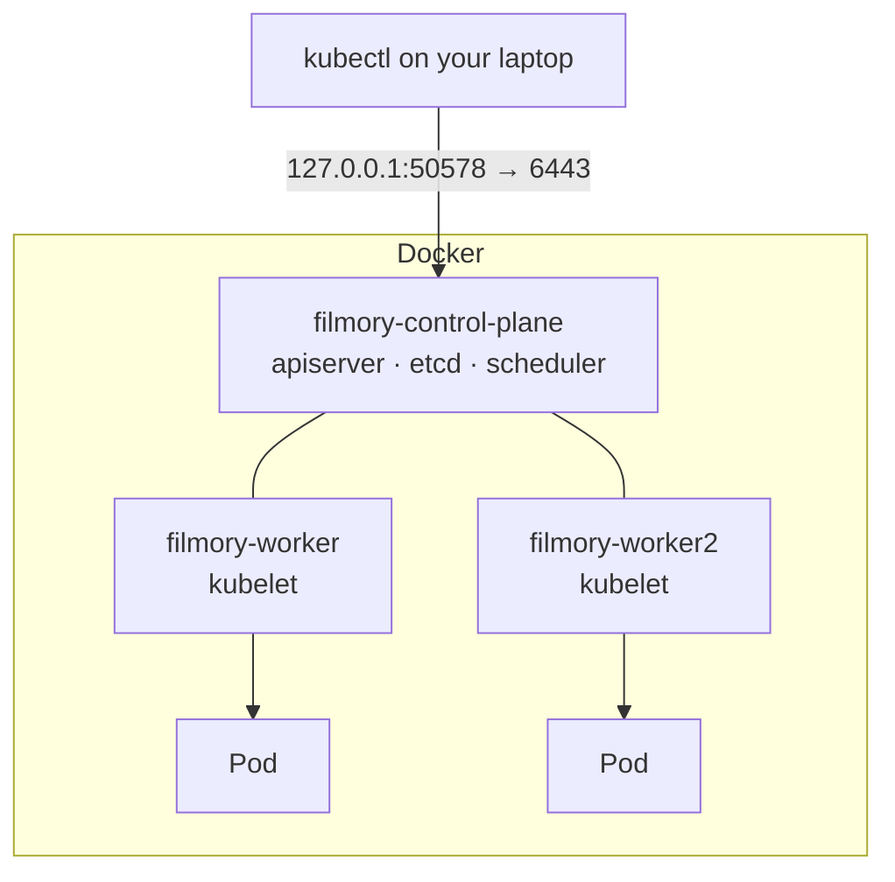

`docker stop filmory-worker` is a genuine node failure. Doing it once and
watching the Pods reschedule is worth more than reading about it.

## kind-config.yaml

Read **once**, by the `kind` CLI, at `create cluster` time. Kubernetes never
sees it, and editing it later changes nothing — the cluster must be recreated.
This is the opposite of everything in `k8s/`, which lives inside the cluster and
is reconciled forever.

### Fields we use

```yaml
kind: Cluster                     # the object type kind expects
apiVersion: kind.x-k8s.io/v1alpha4
name: filmory                     # → containers filmory-*, context kind-filmory

nodes:
  - role: control-plane
  - role: worker
  - role: worker
```

`name` matters more than it looks: it prefixes the container names *and* the
kubeconfig context (`kind-filmory`). Without it you get `kind`, and a second
project silently collides with the first.

Three nodes rather than one so scheduling, affinity, and node failure behave
like a real cluster. A single-node cluster hides all of it — including the thing
you already saw, two Pods landing on two different workers.

### Fields we will need later

```yaml
networking:
  disableDefaultCNI: true   # for Cilium — kind installs kindnet by default
  kubeProxyMode: none       # Cilium replaces kube-proxy entirely

nodes:
  - role: control-plane
    extraPortMappings:      # publish a container port to the host
      - containerPort: 30080
        hostPort: 8080
    extraMounts:            # bind-mount a host directory into the node
      - hostPath: /some/path
        containerPath: /data
```

`extraPortMappings` is how a Gateway or Ingress becomes reachable at
`localhost:8080` without `port-forward`. `extraMounts` is how storage that needs
real host paths gets them.

Both require a cluster recreate, which is the argument for thinking about them
before Phase 7 rather than during it.

## Cluster lifecycle

| Command | Does |
|---|---|
| `kind create cluster --config kind-config.yaml` | build it |
| `kind get clusters` | list clusters on this machine |
| `kind delete cluster --name filmory` | destroy it — instant, no confirmation |
| `kind export logs` | dump every node's logs to a directory |
| `docker stop filmory-worker` | simulate node failure |

Recreating is cheap and expected. Treat the cluster as disposable — everything
that matters is in git, and if it is not, that is the bug.

## Getting images in — there is no registry

The gotcha that catches everyone. `filmory-backend:0.1.1` is built by Docker on
your laptop. The kind nodes are *different* Docker environments and cannot see
it, and there is no registry to pull from.

```bash
kind load docker-image filmory-backend:0.1.1 --name filmory
```

This copies the image into every node. It must be re-run after **every** rebuild
— nothing watches for changes.

Two consequences:

- **`imagePullPolicy: IfNotPresent` is mandatory.** The default for a tag other
  than `latest` is already `IfNotPresent`, but state it explicitly. `Always`
  would try to pull from a registry that does not have the image and fail with
  `ErrImagePull`.
- **Never use `latest`.** Its default policy *is* `Always`, so it fails here for
  the same reason — and it is the wrong habit for Phase 6 regardless.

A rebuild without a reload is the classic "my change did not deploy": the Pod
restarts and cheerfully runs the old image, because a matching tag is already
present.

## Versions and skew

The cluster's Kubernetes version comes from the **node image**, not from the
`kind` binary version:

```
kind v0.32.0        ← the CLI, from mise.toml
kindest/node:v1.36.1 ← the cluster's actual Kubernetes version
kubectl v1.36.4      ← the client, pinned in mise.toml
```

`kubectl` is supported within **one minor version** of the apiserver. Here 1.36.4
against 1.36.1 is the same minor — zero skew.

Bumping `kind` can move the default node image and therefore the cluster
version, out from under a pinned `kubectl`. To pin the cluster version
explicitly instead of inheriting it:

```bash
kind create cluster --config kind-config.yaml --image kindest/node:v1.36.1
```

Check after every `kind` bump:

```bash
kubectl version   # compare Client Version with Server Version
```

## kubeconfig and contexts

`kind create cluster` writes into `~/.kube/config` and switches your current
context to it. The context is named `kind-<cluster name>` — here `kind-filmory`.

```bash
kubectl config current-context      # kind-filmory
kubectl config get-contexts         # everything you can reach
kubectl config use-context kind-filmory
```

Worth internalising now: `kubectl` always acts on the *current context*. The
same command is harmless locally and catastrophic against a real cluster. Check
before running anything destructive.

`kind delete cluster` removes its own entry, so contexts do not accumulate.

## What kind cannot do

The shared-kernel tradeoff, and the parts of Phase 7 it touches:

| Want | Situation on kind |
|---|---|
| `LoadBalancer` Services | stay `Pending` forever — no cloud LB exists. MetalLB, or `cloud-provider-kind` |
| Host-reachable ingress | needs `extraPortMappings`, decided at create time |
| Longhorn | wants iSCSI and kernel modules a container may not load |
| Cilium | eBPF needs kernel features and privileges; usually works, expect extra flags |
| Persistent data | `local-path` is the default StorageClass; data dies with the node |
| Real node failure | `docker stop` is close, but the kernel is still shared |
| Performance testing | meaningless — everything shares one machine |

None are blockers. All are reasons to expect extra steps at Phase 7 rather than
to be surprised by them.

## Errors, and what they actually mean

| Message | Cause |
|---|---|
| `ErrImagePull` / `ImagePullBackOff` | forgot `kind load`, or used `latest`/`Always` |
| Pod runs old code | rebuilt the image but did not `kind load` again |
| `Service` stuck `Pending` | it is `type: LoadBalancer` — nothing provides one |
| `connection refused` on kubectl | Docker is not running, or the cluster was deleted |
| `node(s) had untolerated taint` | you are scheduling onto the control plane; it is tainted by default |
| `context "kind-filmory" does not exist` | cluster deleted, or never created |

## The neighbours

| Tool | What it is | Why not here |
|---|---|---|
| **kind** | vanilla k8s in Docker, multi-node | — |
| **k3d** | k3s in Docker | k3s is not vanilla; different defaults |
| **minikube** | usually one node, can drive a real VM | multi-node is second-class |
| **Docker Desktop k8s** | one node, zero config | no control, hides scheduling |

kind is also what Kubernetes' own CI runs on, which is a decent signal it
behaves like the real thing.

## Rules for this repo

1. The cluster is disposable. Anything not in git does not exist.
2. `kind load` after every image build. Every time.
3. Never `latest`. Tags are explicit, here and in CI.
4. Check `kubectl version` skew after any `kind` or `kubectl` bump.
5. Config changes mean a recreate — plan `disableDefaultCNI` and
   `extraPortMappings` together, not one at a time.
6. Check the context before anything destructive.

---

## Resources

| Topic | Link |
|---|---|
| Config reference | [kind — Configuration](https://kind.sigs.k8s.io/docs/user/configuration/) |
| Loading images | [Loading an Image](https://kind.sigs.k8s.io/docs/user/quick-start/#loading-an-image-into-your-cluster) |
| Ingress on kind | [Ingress](https://kind.sigs.k8s.io/docs/user/ingress/) |
| LoadBalancer on kind | [cloud-provider-kind](https://github.com/kubernetes-sigs/cloud-provider-kind) |
| Node images | [kind releases](https://github.com/kubernetes-sigs/kind/releases) |
| Video — concepts | [Kubernetes (and Helm) in 21 Minutes](https://www.youtube.com/watch?v=RUjcGn2YeVo) |
| Video — kind | [Getting Started with kind](https://www.youtube.com/watch?v=kR0YJfaGhfU) |
| Curated list | [resource.md](resource.md) |

- Kind Tutorial: Kubernetes in Docker - Complete Beginner's Guide to Local K8s Clusters
https://www.youtube.com/watch?v=N4kwKtdcDWA

- Multi-node cluster config
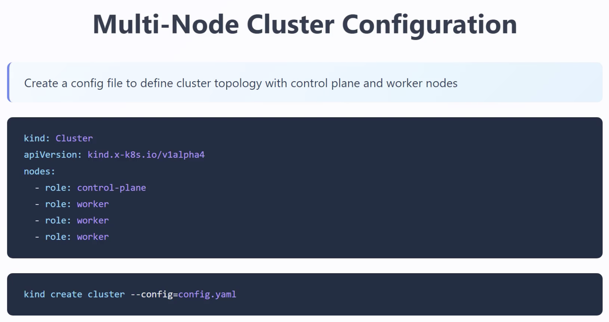

- Port Mapping config
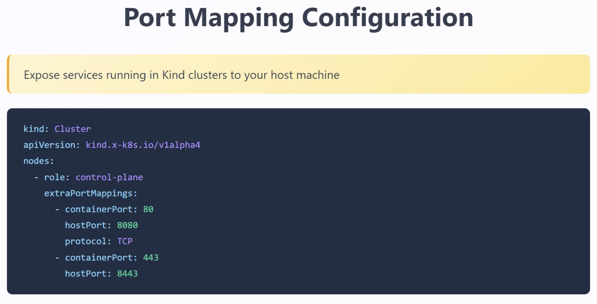

- commands 
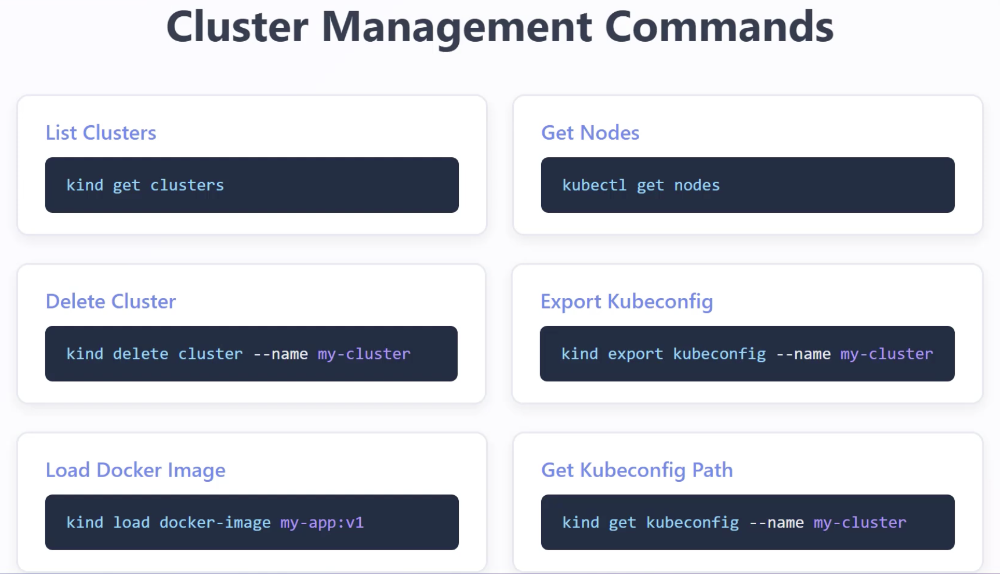
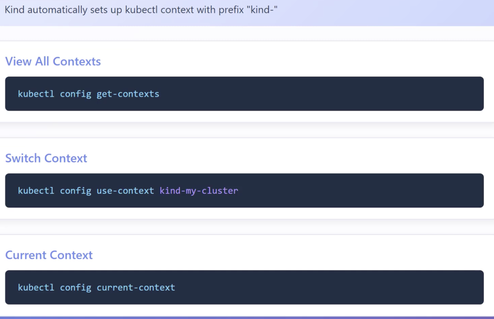

---


## extra notes (script example wiwth mongo setup)


config map syntax
https://www.youtube.com/watch?v=s_o8dwzRlu4&t=104s
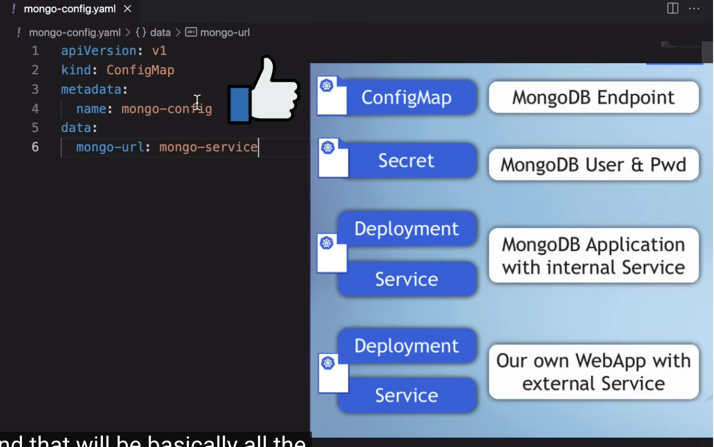

ex: mongo.yaml 
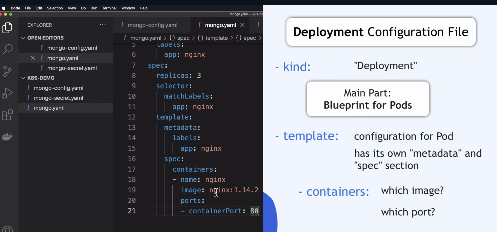
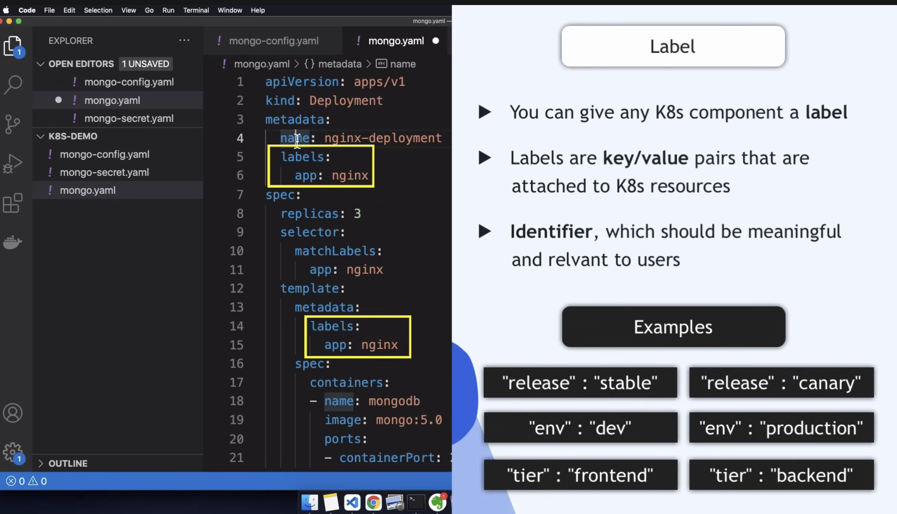
label selectors ->
```yaml
selectors
  matchlabels:  
    [custom name] : [app name]
    app[->conventional name] : mongo[app name]
```
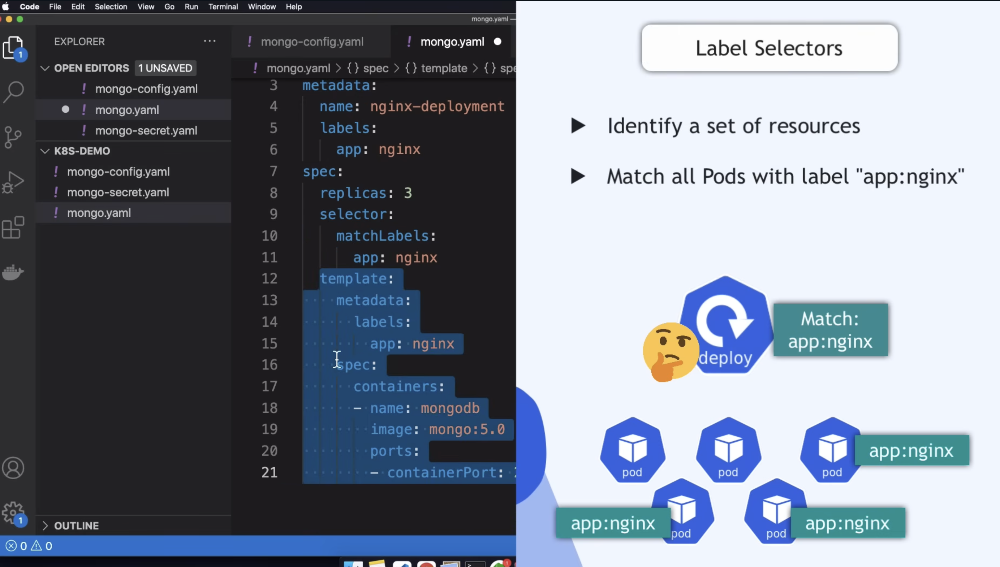

service -> forward the request into the server pods
```yaml
spec:
  selector:
    app : mongo
  ports:
    - protocol: TCP
      port: [service port]
      targetPort: [continerPort of deployment]

=> targetPort should be the same as containerPort
```
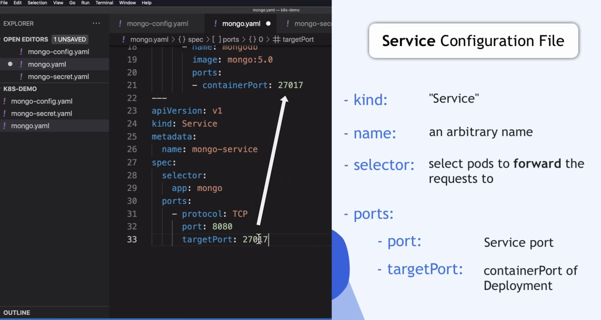
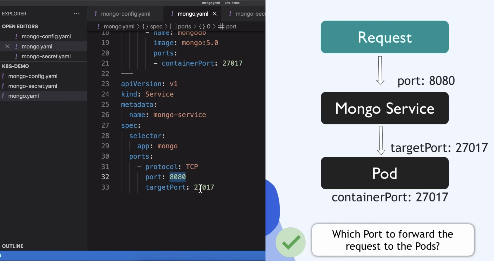
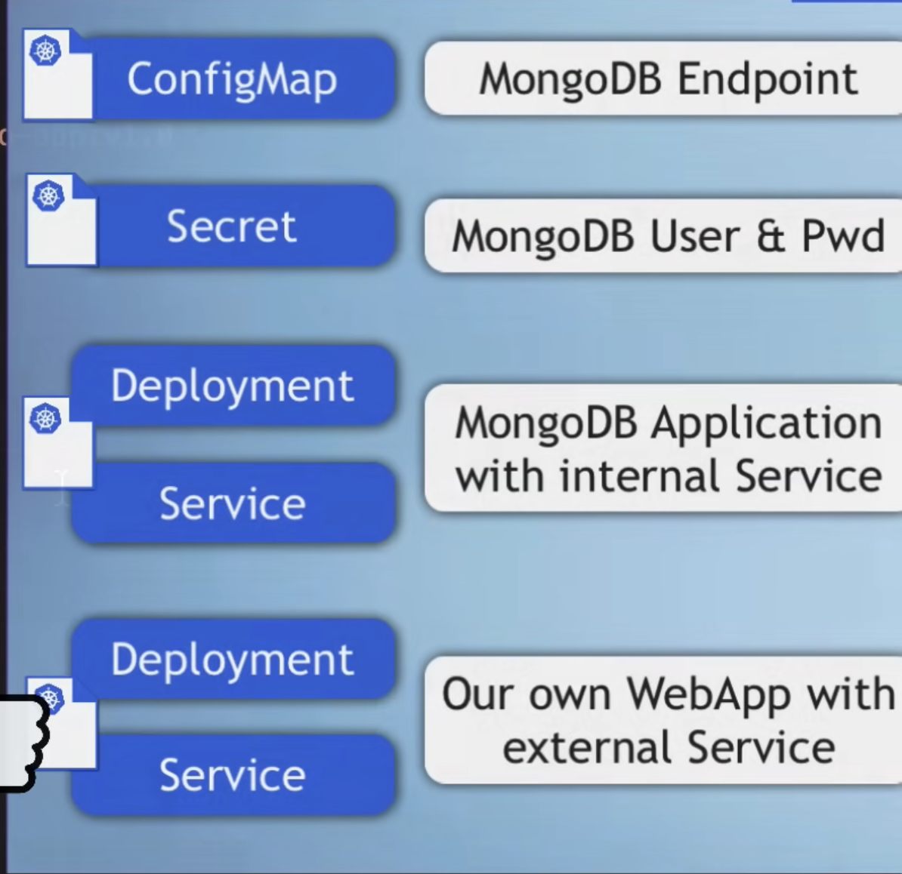

envirment name , in `mongo.yaml`
[A]
```yaml
spec:
  env:
  - name: MONGO_INITDB_ROOT_USERNAME
    value: [(directly set here)username]
```
OR 
[B] reference on `mongo-config.yaml` and `mongo-secret.yaml`
```yaml
spec:
  env:
  # username
  - name: MONGO_INITDB_ROOT_USERNAME
    valueFrom:
      secretKeyRef:
        name: mongo-secret  # yaml file name
        key: mongo-user     # key inside yaml file 
        # => value stored in another secret.yaml file 

  # password 
  - name: MONGO_INITDB_ROOT_PASSWORD
      valueFrom:
      secretKeyRef:
        name: mongo-secret   # yaml file name
        key: mongo-password  # key inside yaml file
```
=> in `mongo-secret.yaml`:
```yaml
metadata:
  name: mongo-secret
...
data:
  mongo-user: [user value encryped in base 64]
  mongo-password: [user value encryped in base 64]
```


webapp.yaml
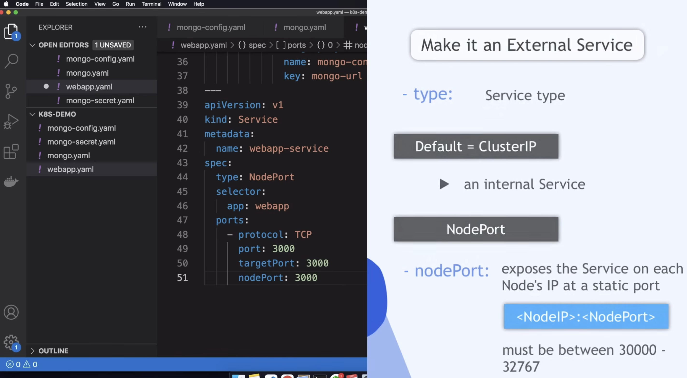
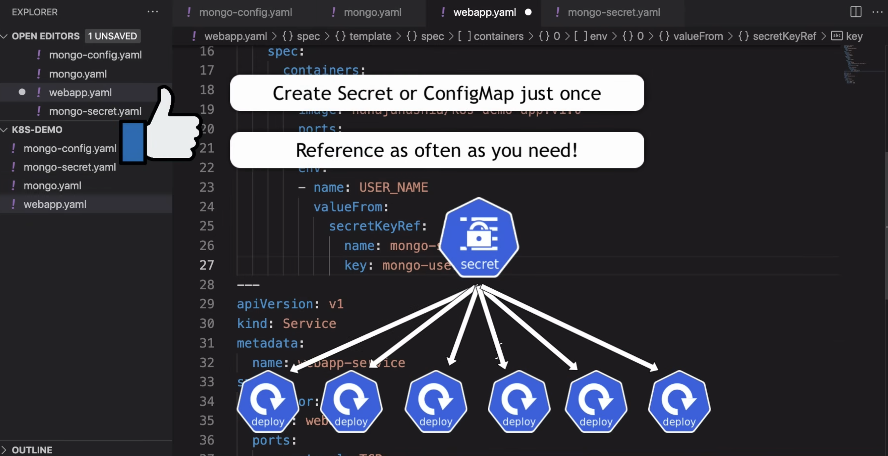
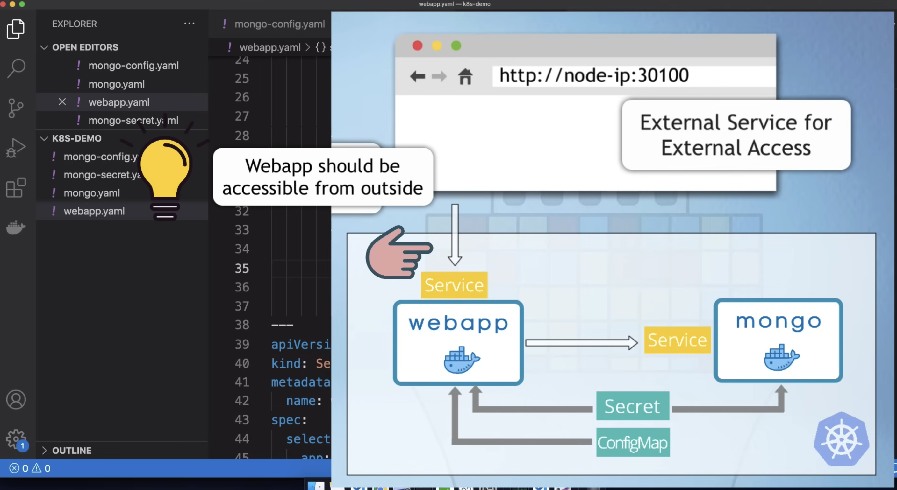